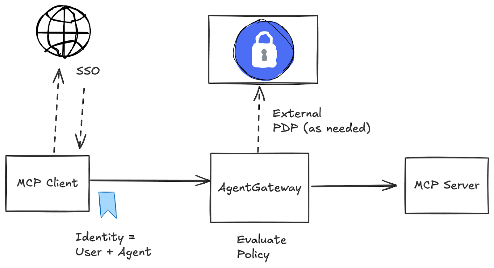
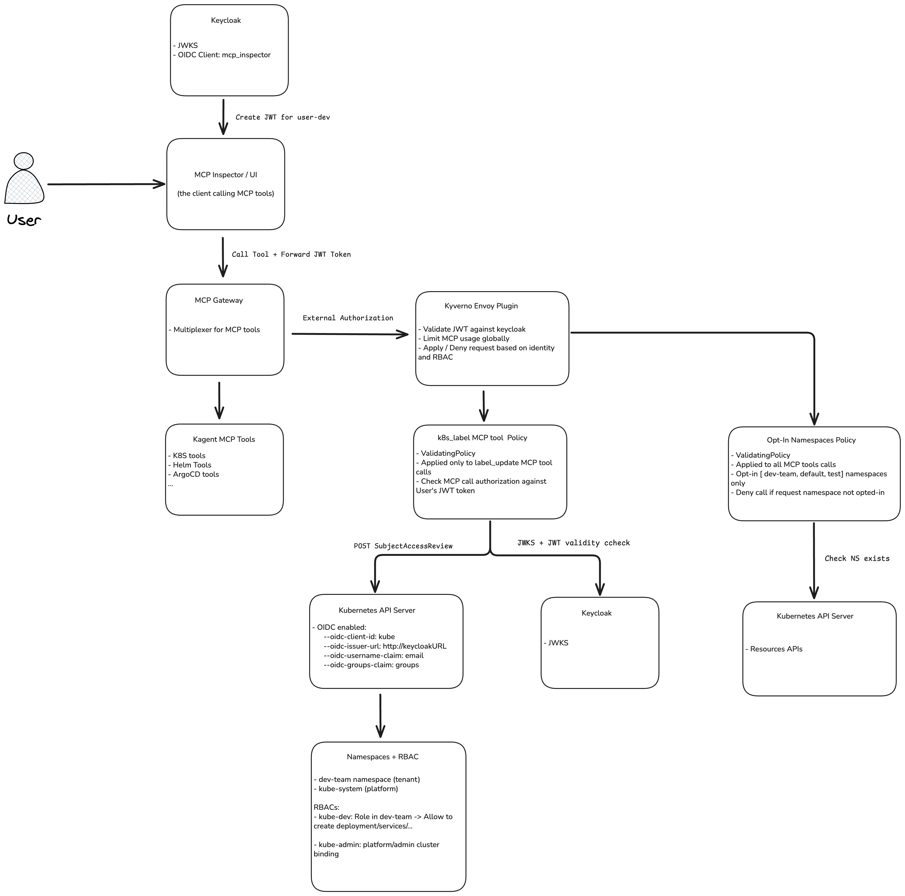

# MCP Least Privileges Demo

## Why we’re doing this demo — the problems we want to solve

### The Gateway Model
[https://www.solo.io/blog/mcp-authorization-is-a-non-starter-for-enterprise](https://www.solo.io/blog/mcp-authorization-is-a-non-starter-for-enterprise)

</a>

### Uncontrolled tool access
  - Today, if an AI agent or user gets access through a service account, it can usually call any Kubernetes API the account is allowed.
  - That means one misconfigured binding could give far more power than intended (e.g., deleting nodes instead of just deploying apps).

###  No per-user accountability
  - When an agent runs with a shared service account, Kubernetes only sees “serviceaccount:agent” in audit logs.
  - We can’t tell if it was Alice or Bob who triggered a risky action — the identity of the actual human is lost.

###  Namespace & tenant isolation
  - Developers should only manage workloads in their namespace (e.g., dev-team).
  - Without proper enforcement, an agent could accidentally create or modify resources in the wrong tenant’s space.

###  Business guardrails are missing
  - RBAC alone can’t express rules like “you can scale deployments, but not to more than 5 replicas” or “only use approved images.”
  - We need extra validation to enforce these kinds of policies.

###  LLM/MCP integration adds new risks
  - Large Language Models are very good at “inventing” actions.
  - Without tight mapping between tools and real Kubernetes permissions, an LLM could attempt operations that bypass normal security controls.

## What we’re showing

- How an MCP Gateway can sit between users/agents and Kubernetes.
- How we can use Kyverno to make sure each tool call (like “create deployment”) is:
  - Authenticated with the user’s real identity from Keycloak.
  - Checked against Kubernetes RBAC for least privilege.
  - Optionally validated with policy guardrails.
- Result: the AI agent or UI can only do what the actual user is allowed to do, in the right namespace, with safe defaults.

👉 This way, we’re solving: least privilege, per-user auditing, tenant isolation, and safe guardrails — while still letting developers interact with Kubernetes through more user-friendly interfaces.

## What we're implementing

</a>

### Tools used
- Kind
- kyverno-envoy-plugin
- Agentgateway + Kgateway
- Keycloak
- Kubernetes RBACs

## Possible improvements / things left to do

- Instead of denying, we could also enrich the resopnse with additional context